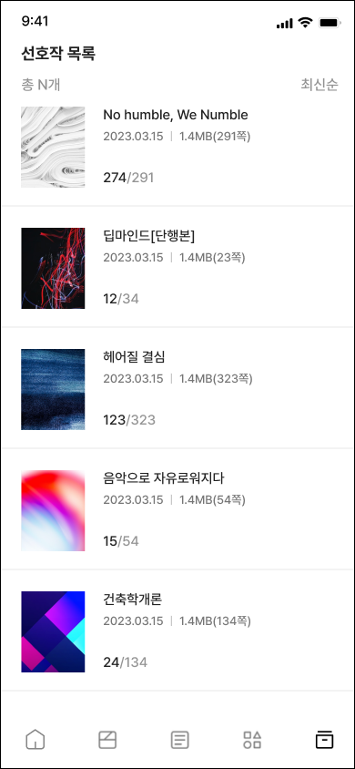

<!-- Banner Image -->

<p align="center">
  <a href=".">
    
    <h1 align="center">Bookhub</h1>
  </a>
</p>

<p align="center">
  <a aria-label="Numble" href="https://www.numble.it/" target="_blank">
    
  </a>
   <a aria-label="Expo" href="https://expo.dev/client" target="_blank">
    
  </a>
  <a aria-label="Expo is free to use" href="https://github.com/expo/expo/blob/main/LICENSE" target="_blank">
    
  </a>
</p>


<p align="center">
  <a aria-label="try expo with snack" href="https://snack.expo.dev"><b>Try Expo in the Browser</b></a>
 |
  <a aria-label="expo documentation" href=".">Read the Documentation 📚</a>
</p>
  
---

<p align="center">
<strong>Bookhub</strong> is a next-generation web novel platform:stuck_out_tongue_winking_eye:, developed as a side project by <a aria-label="Numbe deepdive" href="https://www.numble.it/deepdive/41" target="_blank">Numble</a>.
</p>

<p align="center">
   
   
   
   
   
</p>

## 📚 Documentation

<p>Learn about building and deploying our apps <a aria-label="documentation" href=".">in our official docs!</a></p>

- [Project Introduction](https://www.numble.it/deepdive/41)
- [Getting Started]()
- [Requirement Specification]()
- [Architecture Design]()
- [Wireframe & Storyboard]()
- [API Reference]()
- [Data Modeling & ERD]()

# Project Layout

This project is based on [Turborepo](https://turbo.build/repo/docs), which is an intelligent build system optimized for JavaScript and TypeScript codebases.

## What's inside?

This Turborepo includes the following packages/apps:

### Apps and Packages

- `native`: a [react-native](https://reactnative.dev/) app built with [expo](https://docs.expo.dev/)
- `web`: a [Next.js](https://nextjs.org/) app built with [react-native-web](https://necolas.github.io/react-native-web/)
- `ui`: a stub [react-native](https://reactnative.dev/) component library shared by both `web` and `native` applications
- `tsconfig`: `tsconfig.json`s used throughout the monorepo

Each package/app is 100% [TypeScript](https://www.typescriptlang.org/).

### Utilities

- [Expo](https://docs.expo.dev/) for native development
- [TypeScript](https://www.typescriptlang.org/) for static type checking
- [Prettier](https://prettier.io) for code formatting

## Getting Started

Run the following command:

```sh
cd bookhub
yarn dev
```
